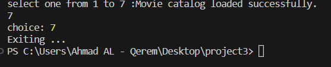

# Output

## main menu :

## sample of data saved in json file : 

## show all movies loaded into project :

## add new movie :

## check if this movie added :

## try to update this movie :

## check if this movie updated :

## try to delete this movie :

## check if this movie updated :

## search on movie using api :

## search results :

## use filters ( by Genre ):

## use filters ( by release year ):

## Exit :

